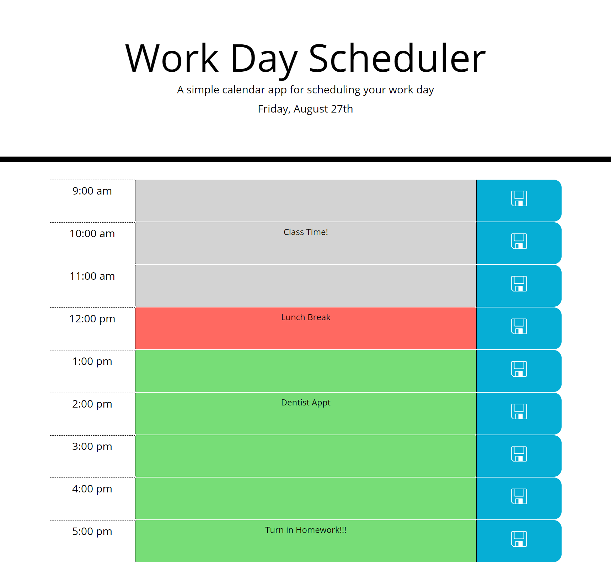

# Work Day Scheduler

A simple day planner that allows users to save events to time blocks on their schedule. Features color coded time blocks to separate blocks between past, present, and future.

## Links

[Live Website](https://kerilp.github.io/work-day-scheduler/)

[Source Code](https://github.com/kerilp/work-day-scheduler)

## Technology Used

Languages: HTML, CSS, JavaScript

Tools: [Moment JS](https://momentjs.com/)

## Screenshots

## License

MIT License
